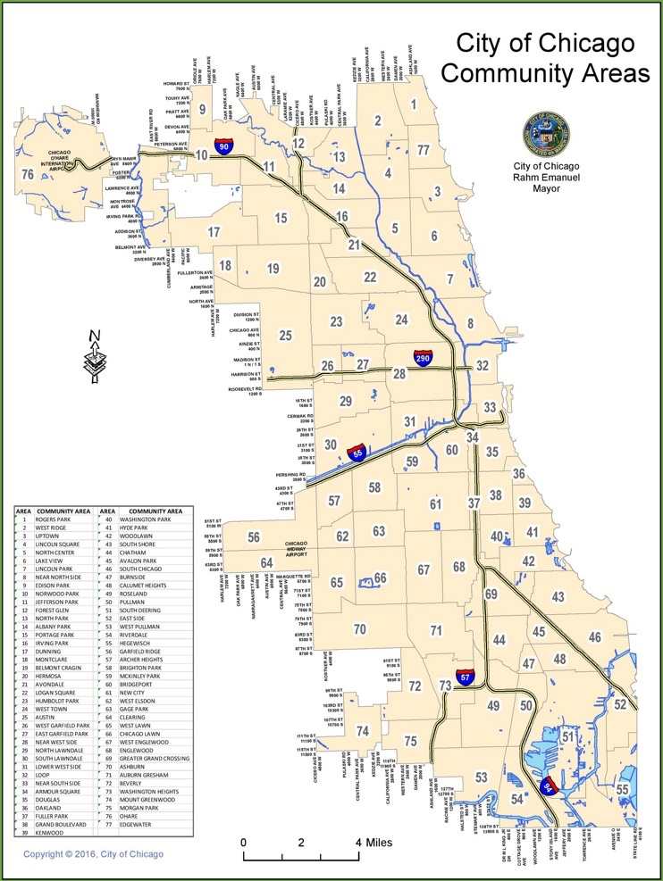

# Predicting hourly taxi rides at Chicago's O'Hare airport

Authors: Jarome Leslie, Derek Kruszewski

This project examines whether data on flight arrivals, seat counts, and passenger estimates may be combined with weather data to predict the hourly taxi demand.

## Table of Contents
- [Data collection](#data-collection)
- [Exploratory data analysis]()
- [Model and feature selection]()
- [Results discussion]()
- [Conclusions]()


## Data collection
The data collection stage of this project proved non-trivial due to multitude of sources used. Our collection efforts may be separated into three groups:

- taxi data collection;
- weather data collection; and
- passenger arrival estimation.

**Chicago Taxi trips**

Taxi data for O'Hare International Airport ("ORD") was obtained from the City of Chicago by querying the Chicago Taxi trips dataset in Google's BigQuery datawarehouse via a Kaggle kernel. The Kaggle kernel notebook may be accessed [here](https://www.kaggle.com/jleslie246/querying-ord-trips-from-the-chicago-taxi-dataset). The dataset contains trips dating from 2013 to 2018 from approximately 7,000 licensed cabs in the city operated by private companies.

The following code chunks describe how taxi data was extracted for the purposes of this project. First, the BigQuery tool `bq_helper` was imported following the directions provided in the [kaggle dataset documentation](https://www.kaggle.com/chicago/chicago-taxi-trips-bq).

```
import bq_helper
from bq_helper import BigQueryHelper
# https://www.kaggle.com/sohier/introduction-to-the-bq-helper-package
chicago_taxi = bq_helper.BigQueryHelper(active_project="bigquery-public-data",
                                   dataset_name="chicago_taxi_trips")
```

Next, SQL was used to select datetime parameters `YEAR`, `MONTH`, `DAY` and `HOUR` as well as the count of rides leaving the airport region. As seen in the Figure below, O'hare International Airport occupies its own community area in are 76, located in the Northwest corner of the city limits. Lastly, the query output was saved as `.csv` file. 


### Figure 1: Chicago community area map highlighting O'hare International Airport 

<div style="text-align:center"></div>

Source: [City of Chicago](http://ontheworldmap.com/usa/city/chicago/chicago-community-areas-map.jpg)


```
 # ORD is located community area 76
query1 = """SELECT

pickup_community_area,
EXTRACT(YEAR FROM trip_start_timestamp) AS year,
EXTRACT(MONTH FROM trip_start_timestamp) AS month,
EXTRACT(DAY FROM trip_start_timestamp) AS day,
EXTRACT(HOUR FROM trip_start_timestamp) AS hour,
COUNT(1) AS rides

FROM
  `bigquery-public-data.chicago_taxi_trips.taxi_trips`
  
WHERE
    pickup_community_area = 76
    
GROUP BY
    pickup_community_area, year,month, day, hour

ORDER BY
    year,month, day, hour
    
        """
response1 = chicago_taxi.query_to_pandas_safe(query1, max_gb_scanned=10)                                  
response1.to_csv('ORD_outbound.csv')
```


**Weather data**

Weather data for O'Hare Internation Airport ("ORD") was obtained from the Iowa State University Iowa Environmental Mesonet Automated Surface Observing System ("ASOS") Network, accessed [here](https://mesonet.agron.iastate.edu/ASOS/). ASOS stations are located at airports across the US and support the operations of the National Weather Service, the Federal Aviation Administration, and US Department of Defence. Using there variable descriptions provided [here](https://mesonet.agron.iastate.edu/request/download.phtml?network=IL_ASOS), data was collected for the 2013-2018 period at the hourly level for the following parameters:
 - `temperature` in Farenheit; 
 - `dew_point` in Farenheit; 
 - `relative_humidity`;
 - `wind_speed` in knotts;
 - `precipitation` in inches;
 - `visibility` in miles;
 - `placeholder1`;
 - `placeholder2`;
 - `placeholder3`; and
 - `wind_chill` in Farenheit.

The `download_weather.py` script found [here](https://github.com/jsleslie/Ohare_taxi_demand/blob/master/src/download_weather.py) was used to download the weather data as shown below.

```
python download_weather.py http://mesonet.agron.iastate.edu/cgi-bin/request/asos.py?
```

**Flights data**
