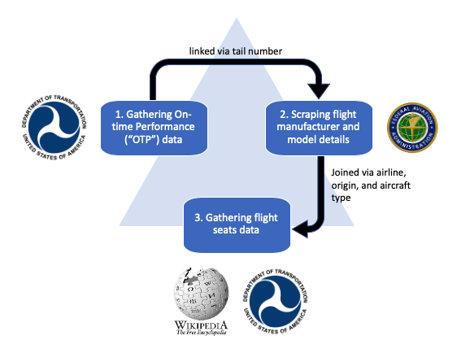

# Predicting hourly taxi rides at Chicago's O'Hare airport

Authors: Jarome Leslie, Derek Kruszewski

This project examines whether data on flight arrivals, seat counts, and passenger estimates may be combined with weather data to predict the hourly taxi demand.

## Table of Contents
- [Data collection](#data-collection)
- [Exploratory data analysis](#exploratory-data-analysis)
- [Model and feature selection](#model-and-feature-selection)
- [Results discussion](#results-discussion)
- [Conclusions](#conclusions)
- [References](#references)


## Data collection
The data collection stage of this project proved non-trivial due to multitude of sources used. Our collection efforts may be separated into three groups:

- taxi data collection;
- weather data collection; and
- passenger arrival estimation.

### Chicago Taxi trips

Taxi data for O'Hare International Airport ("ORD") was obtained from the City of Chicago by querying the Chicago Taxi trips dataset in Google's BigQuery datawarehouse via a Kaggle kernel. The Kaggle kernel notebook may be accessed [here](https://www.kaggle.com/jleslie246/querying-ord-trips-from-the-chicago-taxi-dataset). The dataset contains trips dating from 2013 to 2020 from approximately 7,000 licensed cabs in the city operated by private companies.

The following code chunks describe how taxi data was extracted for the purposes of this project. First, the BigQuery tool `bq_helper` was imported following the directions provided in the [kaggle dataset documentation](https://www.kaggle.com/chicago/chicago-taxi-trips-bq).

```
import bq_helper
from bq_helper import BigQueryHelper
# https://www.kaggle.com/sohier/introduction-to-the-bq-helper-package
chicago_taxi = bq_helper.BigQueryHelper(active_project="bigquery-public-data",
                                   dataset_name="chicago_taxi_trips")
```

Next, SQL was used to select datetime parameters `YEAR`, `MONTH`, `DAY` and `HOUR` as well as the count of rides leaving the airport region. As seen in the Figure below, O'hare International Airport occupies its own community area in are 76, located in the Northwest corner of the city limits. Lastly, the query output was saved as `.csv` file. 


**Figure 1: Chicago community area map highlighting O'hare International Airport**

<p align="center"> </p>

Source: [City of Chicago](http://ontheworldmap.com/usa/city/chicago/chicago-community-areas-map.jpg)


```
 # ORD is located community area 76
query1 = """SELECT

pickup_community_area,
EXTRACT(YEAR FROM trip_start_timestamp) AS year,
EXTRACT(MONTH FROM trip_start_timestamp) AS month,
EXTRACT(DAY FROM trip_start_timestamp) AS day,
EXTRACT(HOUR FROM trip_start_timestamp) AS hour,
COUNT(1) AS rides

FROM
  `bigquery-public-data.chicago_taxi_trips.taxi_trips`
  
WHERE
    pickup_community_area = 76
    
GROUP BY
    pickup_community_area, year,month, day, hour

ORDER BY
    year,month, day, hour
    
        """
response1 = chicago_taxi.query_to_pandas_safe(query1, max_gb_scanned=10)                                  
response1.to_csv('ORD_outbound.csv')
```


### Weather data

Weather data for O'Hare Internation Airport ("ORD") was obtained from the Iowa State University Iowa Environmental Mesonet Automated Surface Observing System ("ASOS") Network, accessed [here](https://mesonet.agron.iastate.edu/ASOS/). ASOS stations are located at airports across the US and support the operations of the National Weather Service, the Federal Aviation Administration, and US Department of Defence. Using there variable descriptions provided [here](https://mesonet.agron.iastate.edu/request/download.phtml?network=IL_ASOS), data was collected for the 2013-2020 period at the hourly level for the following parameters: `temperature` in Farenheit, `dew_point` in Farenheit, `wind_chill` in Farenheit, `relative_humidity`, `wind_speed` in knotts, `precipitation` in inches, `visibility` in miles; and `sky_condition`.

The `download_weather.py` script found [here](https://github.com/jsleslie/Ohare_taxi_demand/blob/master/src/download_weather.py) was used to download the weather data as shown below.

```
python download_weather.py http://mesonet.agron.iastate.edu/cgi-bin/request/asos.py?
```

### Flights data

Data related to passenger arrivals was collected from four sources. As seen in Figure 2 below, data was first collected from the US Bureau of Transportation's Flight On-time Performance ("OTP") dataset found [here](https://www.transtats.bts.gov/DL_SelectFields.asp?Table_ID=236), the Federal Aviation Administration's ("FAA") Registry on N-Numbers found [here](https://registry.faa.gov/aircraftinquiry/nnum_inquiry.aspx), the US Bureau of Transportation's Air Carrier's dataset, and airline fleet descriptions found on Wikipedia.

**Figure 2. Flight data collection steps**

<p align="center">  </p>


The **US Bureau of Transportation's OTP's** dataset contains details for flights going into ORD from 142 airports across the US with the following attributes: `weekday`, `flight date`, `airline code`, `tail number` a FAA unique identifier, `origin` airport codes, `arrival time`, and `arrival delay` in minutes.

The **FAA Registry** was scraped to search for each tail number contained in the OTP dataset. This allows us to augment the data table to include the `manufacturer` and `model number` for each plane which will be useful later in determining the number of seats on each flight.

The **US Bureau of Transportation's Air Carrier's** dataset provides a monthly report on airline route statistics including pertinent information such as `total passengers` transported in the month, `total seats` available for sale, the `departures_performed`, the `airline` and the `aircraft type`. This information was used to calculate the number of seats on each aircraft used by each airline.

To augment the airline-level on the number of seats on each plane, **Wikipedia** fleet descriptions were scraped. The airline fleet matrices from wikipedia indicate the number of planes in service for a specific airline as well as the seat counts of said planes. This information was used to estimate a flight's seat count for cases when a flight's tail number is absent or incomplete from the FAA Registry.


These data sets were obtained using the following commands:

```
python src/download_otp.py
python src/download_tailnums.py
python src/download_seats.py
python src/download_seats_wikipedia.py
```

These were subsequently merged together, along with weather and taxi data using the command: 

```
python src/wrangle_data.py
```

## Exploratory data analysis

## Model and feature selection

## Results discussion

## Conclusions

## References

- *[Automated Surface Observing System Network](https://mesonet.agron.iastate.edu/ASOS/).*  Iowa Environmental Mesonet. Iowa State University. Accessed 2020-05. 

- *[Chicago Taxi Trips](https://www.kaggle.com/chicago/chicago-taxi-trips-bq)*. Kaggle. Accessed 2020-01. 

- Coviensky, A., Katiyal, A., Agrawal, K., and Geary, W. *[Estimating Demand for Taxis at LaGuardia Airport](https://willgeary.github.io/portfolio/assets/images/nycTaxi/report.pdf)*. December 2017.

- *[FAA Registry N-Number Inquiry](https://registry.faa.gov/aircraftinquiry/nnum_inquiry.aspx)*. Federal Aviation Administration. Accessed 2020-04

- *[Reporting Carrier On-Time Performance (1987-present)](https://www.transtats.bts.gov/DL_SelectFields.asp?Table_ID=236)*. US State Department of Transportation. Accessed 2020-04.

- *[T-100 Domestic Segment (All Carriers)](https://www.transtats.bts.gov/DL_SelectFields.asp?Table_ID=311)*. Accessed 2020-04.
